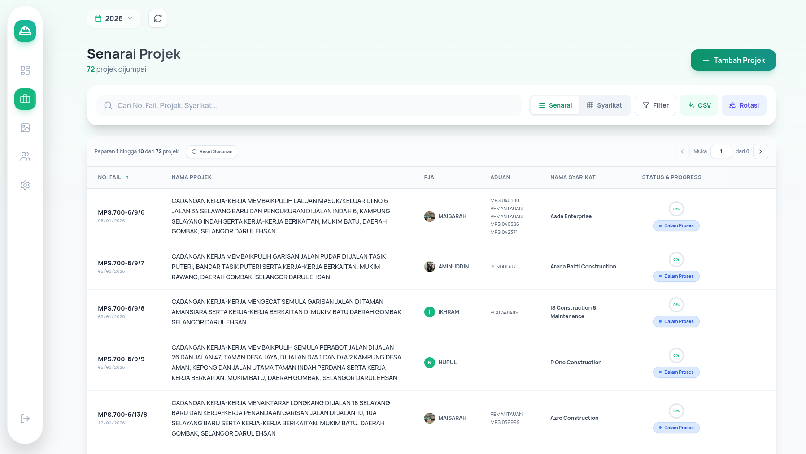
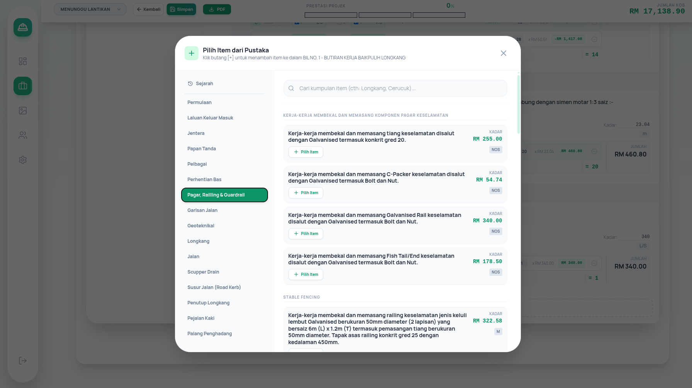

# InfraHub

> Infrastructure Project Management System for Majlis Perbandaran Selayang

<p align="center">
  
</p>

---

## 📌 What is InfraHub?

**InfraHub** is a project management system for Majlis Perbandaran Selayang that helps with:

- ✅ Managing construction projects from start to finish
- ✅ Automatically generating official documents
- ✅ Tracking project costs and progress
- ✅ Facilitating communication between officers

---

## 🎯 Who Is It For?

| Role | Main Responsibilities |
|------|----------------------|
| **Admin (Pembantu Tadbir)** | Manage contractor companies, vote numbers, and system settings |
| **PJA (Penolong Jurutera)** | Prepare BQ, monitor progress, and generate reports |
| **Jurutera** | Sign documents and approve projects |

---

## 🚀 Key Features

### 1️⃣ Dashboard

<p align="center">
  
</p>

- **Project Statistics**: View the number of projects by status in one glance
- **Bulletins**: Latest announcements from administration
- **Search**: Find projects easily
- **Notifications**: Reminders about project deadlines

### 2️⃣ Project List

<p align="center">
  
</p>

- **List View**: See all projects with status and cost
- **Filters**: Filter by status, PJA, zone, or BP
- **Group View**: View projects by company
- **Export**: Download data for analysis

### 3️⃣ BQ Editor (Bill of Quantities)

<p align="center">
  
</p>

- **Automatic Calculations**: Measure dimensions and costs are calculated automatically
- **Preset Library**: Use existing work templates
- **Multiple Locations**: Measure work in different areas
- **Secure Storage**: Data is saved in Cloud for security

### 4️⃣ Document Generators

The system automatically generates various official documents:

| Document | Purpose |
|----------|---------|
| **Aku Janji** | Contractor commitment letter |
| **Notis** | Notification and warning notices |
| **CPC Certificate** | Work completion certificate with DLP calculation |
| **LAD Certificate** | Late work damages penalty |
| **Performance Certificate** | Contractor performance evaluation |
| **Photo Report** | Site report with images and annotations |

### 5️⃣ Admin Settings

- **Manage Companies**: Add and edit contractor company details
- **Manage Votes**: Organize vote codes and budget allocations
- **BQ Templates**: Create and save templates for repeated use
- **Bulletins**: Publish announcements to all users

---

## 📋 Project Phases

Each project goes through **6 phases**:

| Phase | Status | Description |
|-------|--------|-------------|
| **Phase 1** | 📝 Draft | Preparing BQ and initial planning |
| **Phase 2** | ⏳ Pending Appointment | Waiting for company appointment |
| **Phase 3** | 🔧 In Progress | Work is being done |
| **Phase 4** | ✅ Site Inspection | Inspecting progress on site |
| **Phase 5** | 💰 Payment Claim | Processing contractor payments |
| **Phase 6** | 🎉 Complete | Project finished and file closed |

---

## 🛠️ Technology Stack

```
Frontend:    React 19 + TypeScript
Styling:     Tailwind CSS
Database:    PostgreSQL
Icons:       Lucide React
PDF:         jsPDF + @react-pdf/renderer
Build:       Vite
Photo Edit:  Konva (React-Konva) for image annotations 
```

---

## 🚦 Getting Started

### Prerequisites

- Node.js (version 18+)
- PostgreSQL

### Installation Steps

```bash
# 1. Clone the repository
git clone <repository-url>
cd InfraHub

# 2. Install dependencies
npm install

# 3. Set up environment variables (If you use Supabase)
# Create a .env file with:
VITE_SUPABASE_URL=your_supabase_url
VITE_SUPABASE_ANON_KEY=your_supabase_anon_key

# 4. Run the development server
npm run dev

# 5. Open browser at
http://localhost:5173 or http://localhost:3000 
```

### Build for Production

```bash
# Build the application
npm run build

# Preview the build
npm run preview
```

---

## 💾 Database Structure

The system designed for **Supabase** with main tables:

| Table | Purpose |
|-------|---------|
| `projects` | All project data, BQ, and phase tracking |
| `app_users` | User profiles and roles |
| `system_settings` | Yearly settings (companies, votes, templates) |
| `library_groups` | BQ preset templates |
| `bulletins` | Dashboard announcements |

---

## 🌐 Language

**Primary Language**: Bahasa Malaysia (Malay)
**Technical Documentation**: English

All forms, field names, and user-facing content are in **Bahasa Malaysia** for the convenience of primary users (council staff and contractors).

---

## 📞 Support

For any questions or technical support:

- Contact: PT Syafiq
- Location: Jabatan Kejuruteraan, MPS

---

## 📄 License

This project is developed by **ar-Raqmi**.

---

<div align="center">

**Built with ❤️ for Unit Infrastruktur, Jabatan Kejuruteraan MPS**

</div>
