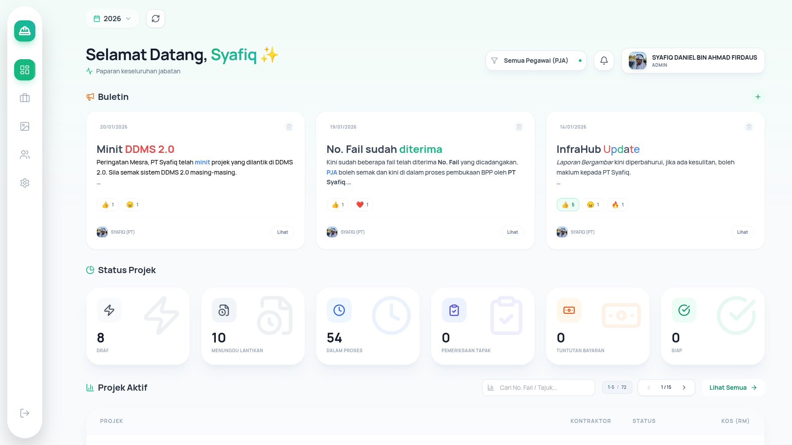
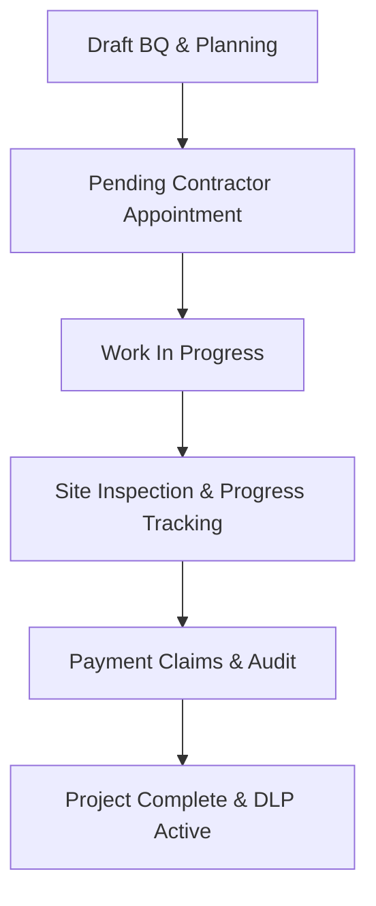

  

<h1 align="center">ElectricHub</h1>

  <strong>Sistem Pengurusan Projek Elektrikal (Electrical Project Management System)</strong> 
  Designed and built for the Engineering Department of <strong>Majlis Perbandaran Selayang (MPS)</strong>.

  <a href="#-about-electrichub">About</a> •
  <a href="#-core-pages">Core Pages</a> •
  <a href="#-user-roles">User Roles</a> •
  <a href="#-project-workflow">Project Workflow</a> •
  <a href="#-support--collaboration">Support</a>

---

## 📋 About ElectricHub

**ElectricHub** is a comprehensive, modern electrical project management system tailored specifically for the engineering department of **Majlis Perbandaran Selayang**. It streamlines the lifecycle of municipal construction and maintenance projects from initial Bill of Quantities (BQ) drafting, through company appointments, execution tracking, site inspection, to final payment processing and closure.

  

---

## 🖥️ Core Pages

Below is an overview of the key pages in the system and their respective functions:

* **🔐 Login (`Login.tsx`)**
  * Secure user authentication with role-based access control (Admin, PJE, Jurutera) to restrict system actions.
* **📊 Dashboard (`Dashboard.tsx`)**
  * The main executive view highlighting ongoing/completed project counts, active bulletins, system notifications and a summary of monthly budgets.
* **📂 Project List (`ProjectsList.tsx`)**
  * An interactive repository of all electrical projects. Supports comprehensive filtering by status, PJE, zone and budget category, with options to export project metadata.
* **🔎 Project Details (`ProjectDetail.tsx`)**
  * The central operational hub for a single project. Displays phase timelines, contract information, contractor details and allows access to specific tools like BQ editors and document generators.
* **📐 BQ & Pelarasan Editors (`BQEditor.tsx` & `BQPelarasanEditor.tsx`)**
  * Rich editors for building Bill of Quantities (BQ) and handling adjustments (Pelarasan). Supports standard library presets, location-based measurements and automatic dimension-based cost calculations.
* **📸 Image Annotation Report (`ImageReportGenerator.tsx`)**
  * A site report generator allowing engineers to upload site progress photos, tag locations, annotate images with custom shapes/texts and compile them into a PDF.
* **📄 Document Generators**
  * Specialized pages to generate formal, audit-ready PDFs:
    * **Aku Janji (`AkuJanjiEditor.tsx`)**: Generates contractor commitment letters.
    * **Notis Generator (`NotisGenerator.tsx`)**: Generates warning and reminder letters.
    * **CPC Certificate (`CPCCertificate.tsx`)**: Formulates Certificate of Practical Completion with DLP calculation.
    * **LAD Certificate (`LADCertificate.tsx`)**: Automates Liquidated & Ascertained Damages penalty reports.
    * **LoC Certificate (`LoCCertificate.tsx`)**: Tracks loc deduction details.
    * **Prestasi Certificate (`PrestasiCertificate.tsx`)**: Scores and creates contractor performance rating reports.
    * **Cover Page (`CoverPageEditor.tsx`)**: Designs customized project document cover sheets.
* **⚙️ Admin Settings (`AdminSettings.tsx`)**
  * Interface for administrators to register contractor details, set up yearly vote codes, allocate budgets, publish dashboard bulletins and edit default BQ templates.
* **👥 Users (`Users.tsx`)**
  * Administrator portal to create, modify and manage user accounts and system credentials.
* **👤 Profile (`Profile.tsx`)**
  * Displays user account details, role information and personal settings.
* **📥 Inbox (`Inbox.tsx`)**
  * System notifications center that alerts users on project status updates and deadlines.

---

## 👥 User Roles

The platform provides role-based workspaces optimized for different administrative and engineering tasks:

| Role | Main Functions |
| :--- | :--- |
| **Admin (Pembantu Tadbir)** | Manages contractor directories, yearly vote/budget codes, template configurations and broadcasts bulletins. |
| **PJE (Penolong Jurutera Elektrik)** | Drafts BQs, updates site metrics, uploads inspections photos and compiles payment claims. |
| **Jurutera** | Reviews project outputs, provides formal signatures and issues certificates. |

---

## 🔄 Project Workflow

Every electrical project in ElectricHub progresses through **6 structured phases**:

---

## 📞 Support & Collaboration

For system inquiries, feature requests or technical support:

* **In-Charge**: PT Syafiq (Unit Elektrikal)
* **Department**: Jabatan Kejuruteraan, Majlis Perbandaran Selayang (MPS)
* **Developer**: by **ar-Raqmi**.
